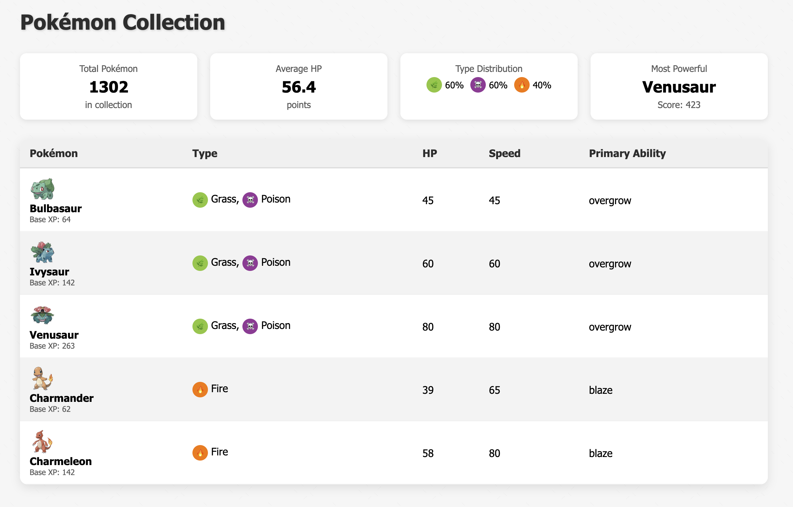
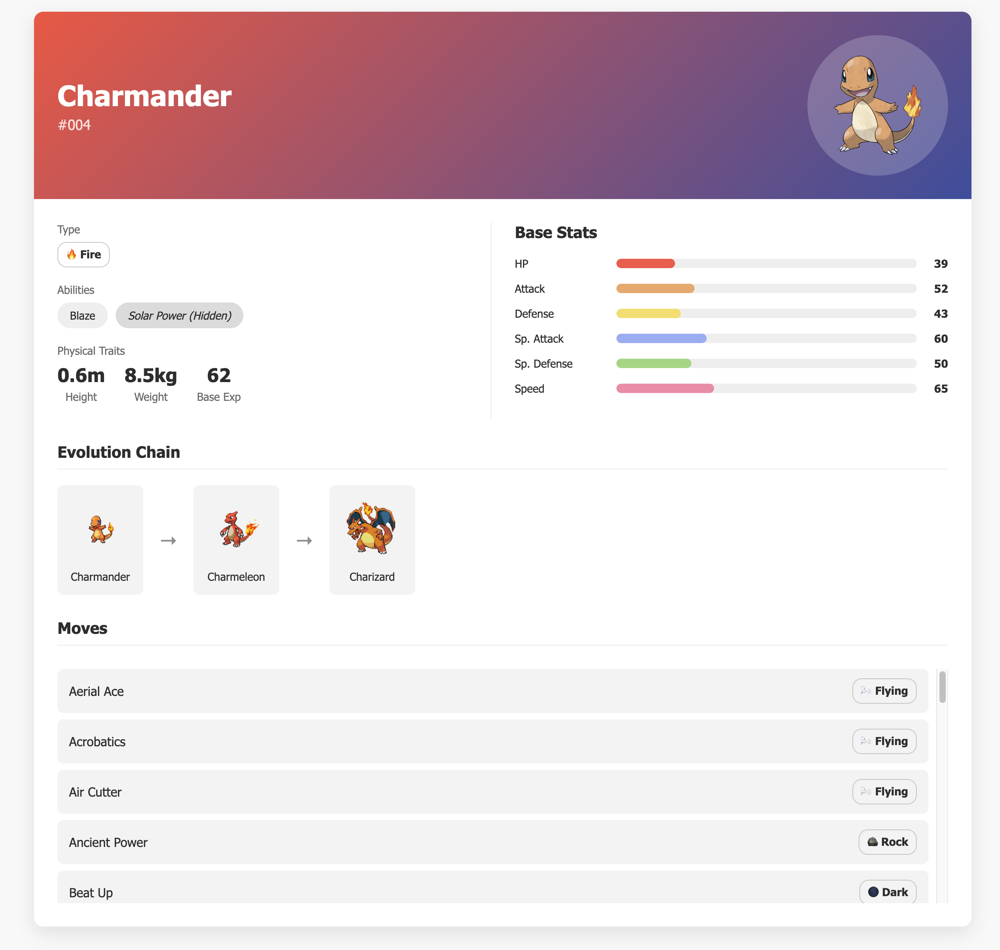
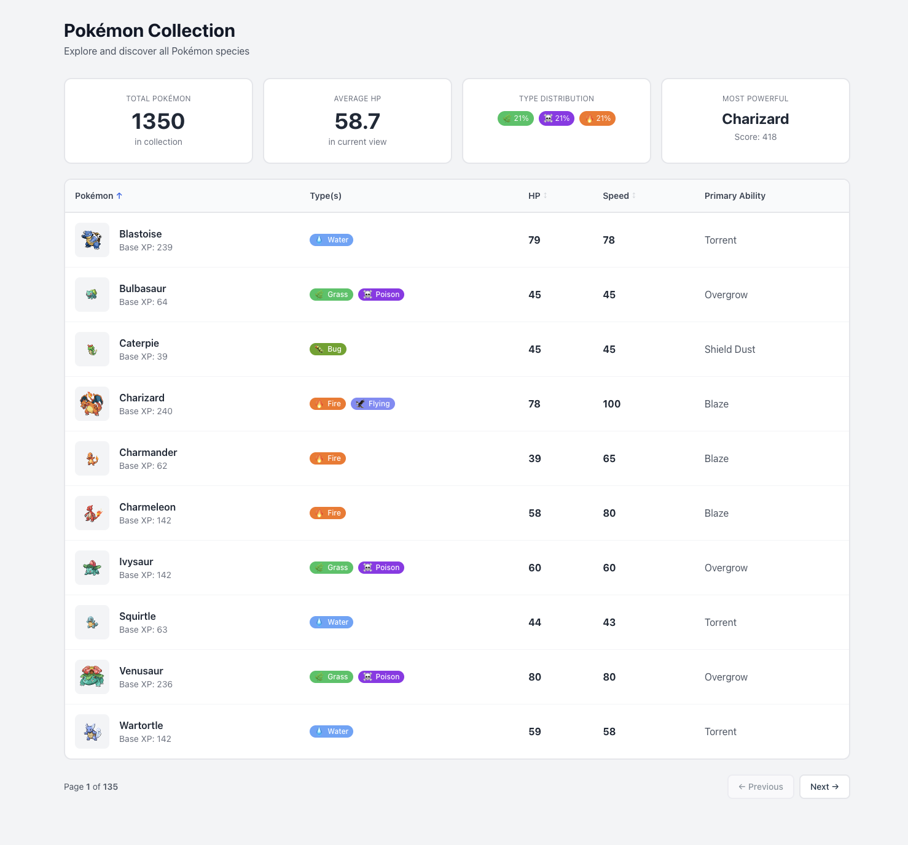
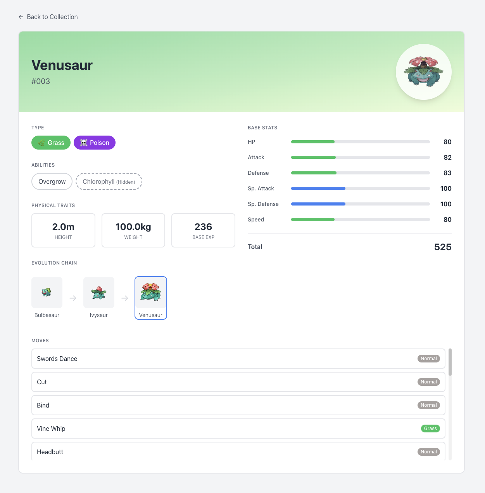

# 🐉 Pokémon Explorer Code Challenge

## Overview

Welcome! This challenge is designed to simulate one slice of Flywire’s day-to-day work: building a fast, accessible, and maintainable React SPA with a real-world public API. You’ll create a small "Pokémon Explorer" that lets users:

1. **Browse** a list of Pokémon in a table view.  
2. **Inspect** details for any Pokémon by clicking its row.

Two wireframes (Table View & Details View) are provided in the `/wireframes` directory as a visual guideline—your implementation should follow their layout and flow but does **not** need to be pixel-perfect.

Behind the scenes you’ll fetch data from [PokeAPI](https://pokeapi.co/) and demonstrate best-in-class frontend practices.

---

## 🚀 Getting Started

1. **Clone** this repo and install dependencies:
   ```bash
   npm install
   ```
2. **Run** in development mode:
   ```bash
   npm start
   ```
3. **Run tests**:
   ```bash
   npm test
   ```
4. **Build** for production:
   ```bash
   npm run build
   ```

---

## 🎯 Mandatory Requirements

1. **Tech Stack**
   - **React** as the primary library (mandatory)  
   - All other choices (TypeScript vs. JavaScript, styling tools, testing frameworks, state management etc.) are yours to decide. See the **Bonus Points** section for technologies that will earn extra credit.  

2. **Table View**  
   - Fetch Pokémon data from PokeAPI and display a paginated list. You can display for example 5 - 10 at a time per page or batch.  
   - Columns:  
     - Sprite image  
     - Name + Base XP  
     - Type(s) (icons or colored badges are optional but desirable)  
     - HP stat  
     - Speed stat  
     - Primary ability
   - The stats header is optional

<div align="center">
  
</div>

1. **Details View**  
   - On row click, show a detail panel or separate route.  
   - Display:  
     - Pokémon name, ID, Official artwork (from sprites.other['official-artwork'].front_default)
     - Type(s)
     - Base stats (HP, Atk, Def, Sp. Atk, Sp. Def, Speed)
     - Physical traits (height, weight, base XP)  
     - Evolution chain (optional)
     - Scrollable list of moves with type labels
   - Implement "back" navigation.  

<div align="center">
  
</div>

4. **Code Quality & Architecture**  
   - Follow TDD if possible: tests first where practical.  
   - Clean, modular, DRY code with clear separation of concerns.  
   - Proper error handling and edge-case coverage.  
   - Accessibility best practices are desirable.

---

## ✨ Bonus Points 💯
- The Stats header in the table view:
     - Show the total amount of pokémon in the collection
     - The average HP in the current view
     - The pokémon type percentages in the current view
     - The most powerful pokémon in the current view, this might be a combination of HP, Speed and base XP 
- **Sorting** by any stat column in the table view
- Routing
- Typescript
- Tailwind CSS for styling
- Jest + React Testing Library for unit/integration tests  
- Playwright for end-to-end tests
- Containerize with **Docker**.
- Responsive design (mobile ↔ desktop).

---

## 📤 Submission

1. Clone the template repo
This challenge is hosted on a starter repository we've prepared for you. Start by cloning it.

2. Work on your solution
Implement your code directly in this repo. Commit early and often — we’d love to see how you approach the problem.

3. (Optional) Document your decisions
If you want to explain architectural decisions, trade-offs, or anything else about your approach, feel free to create a short section at the bottom of the README titled 🧠 Notes or 📌 Design Decisions.

4. Open a Pull Request
When you're done, open a pull request against this repo. Please include a brief summary of what you built, and any notes we should be aware of during the review.

**Good luck!**

-----
### 🧠 Notes:

## My Pokémon Explorer Submission 🐉

Hi, I am Khusboo Kumari! This is my take on the Pokémon Explorer challenge. I wanted to build something that's not just functional, but actually enjoyable to use and easy to maintain.

---

### How to Run

#### Option 1: Docker (easiest)

If you have Docker installed, this is the simplest way:

```bash
git clone <repo-url>
cd stepbystep
docker-compose up --build
# or just
docker-compose up
```

Wait for it to build, then open **http://localhost:3000**

That's it! No need to install Node.js or any dependencies.

---

#### Option 2: Local Development

```bash
# Clone the repo
git clone https://github.com/flywire-homework/dev_KHUSBOO_KUMARI.git

cd dev_KHUSBOO_KUMARI

# Install dependencies
npm install

# Start the dev server
npm run dev
```

Open **http://localhost:5173**

---

#### Running Tests

```bash
# Unit tests
npm test

# E2E tests (make sure dev server is running first)
npm run dev &>/dev/null & sleep 3 && npx playwright test --reporter=line

# or
npx playwright test

```

---

## What I Built

### The Table View

This is the main screen. It shows a paginated list of Pokémon — 10 at a time. 

I added **sorting** because browsing 150+ Pokémon without being able to sort felt frustrating. Click any column header to sort ascending/descending.

The **stats header** at the top shows some fun aggregated data:
- Total Pokémon in the collection
- Average HP of the current page
- Type breakdown (fire: 15%, water: 20%, etc.)
- The "most powerful" Pokémon (calculated from HP + Speed + Base XP)

### The Detail View

Click any Pokémon row and you land on a detailed page 


Hit the back button or use browser navigation to return.

---

## How I Approached This

I started by sketching out the data flow:


The idea was to keep each layer focused on one thing:

- **api/** — Just handles HTTP requests
- **transformers/** — Converts messy API responses into clean objects
- **hooks/** — Manages state and data fetching logic
- **components/** — Pure UI, receives props, renders stuff
- **pages/** — Puts components together for each route

This way, if PokeAPI changes their response format, I only touch the transformer. The rest of the app doesn't care.

---

## Tech Stack

| What | Why I Chose It |
|------|----------------|
| React | Required by the challenge |
| TypeScript | Autocomplete is a lifesaver, catches bugs early |
| Vite | Blazing fast dev server, much better than CRA |
| Tailwind CSS | Rapid styling |
| Jest + React Testing Library | Industry standard for React component testing |
| React Router | Standard for SPA routing |
| Playwright | Reliable E2E testing |

I deliberately **didn't** use Redux or Zustand. The app is simple enough that `useState` + `useEffect` in a custom hook handles everything cleanly. No need to overcomplicate it.

---

## Responsive Design

The app looks great on any screen size:

- **Mobile-first approach** — Base styles for small screens, enhanced for larger ones
- **Flexible table** — Horizontal scroll on mobile, full layout on desktop
- **Adaptive spacing** — Padding and margins adjust based on viewport
- **Fluid typography** — Text scales appropriately across devices

---

## Visual Design

I put extra effort into making the UI polished and cohesive:

- **Type-specific gradients** — Each Pokémon type has a unique gradient background (fire is orange-red, water is blue, etc.)
- **Emojis for personality** — Used emojis throughout the UI to make it feel fun and playful 🔥💧⚡🌿
- **Consistent color palette** — Type colors are reused across badges, stat bars, and detail views
- **Smooth transitions** — Hover effects and animations for a good feel
- **Visual hierarchy** — Clear distinction between primary and secondary information

---

## Accessibility

I made sure the app works for everyone:

- **Keyboard navigation** — Tab through the table, Enter to select
- **Screen readers** — ARIA labels on interactive elements
- **Progress bars** — Proper `role="progressbar"` with min/max values
- **Loading states** — Announced with `aria-live="polite"`
- **Focus indicators** — Visible focus rings on all interactive elements

---

## Testing

I wrote tests at multiple levels:

**Unit tests** for:
- Individual components (TypeBadge, StatBar, etc.)
- Utility functions (formatters, stat calculations)
- API client and transformers

**Integration tests** for:
- The usePokemon hook 
- Component interactions

**E2E tests** with Playwright:
- Loading the table view
- Navigating to detail view
- Pagination
- Sorting

---

## Docker Setup

The production Docker image is optimized:

1. **Build stage**: Node.js compiles the TypeScript and bundles everything
2. **Production stage**: Lightweight nginx serves the static files

Final image size is around 58 MB. Nginx is configured with:
- Gzip compression
- Long cache headers for static assets
- SPA fallback routing (so refreshing `/pokemon/25` works)

---

### What I Completed

* All mandatory requirements:**

* All bonus points:**

---
### View



> 💡 **Bonus:** The application is fully responsive! Try resizing your browser or use DevTools to test how beautiful it looks on tablets, phones, and other devices.

## Final Thoughts

I really enjoyed this challenge. It hit the sweet spot of being complex enough to show real architecture decisions but focused enough to complete thoroughly.

Feel free to reach out if you have any questions about my implementation!

Thanks for reviewing 🙏


# all-stack
